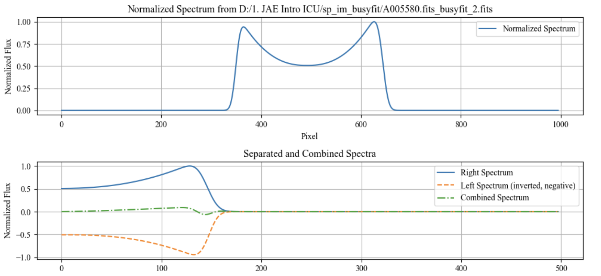
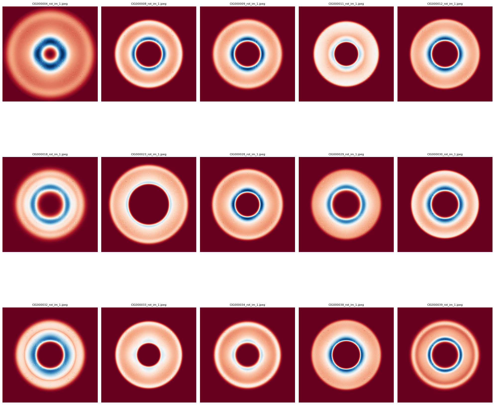
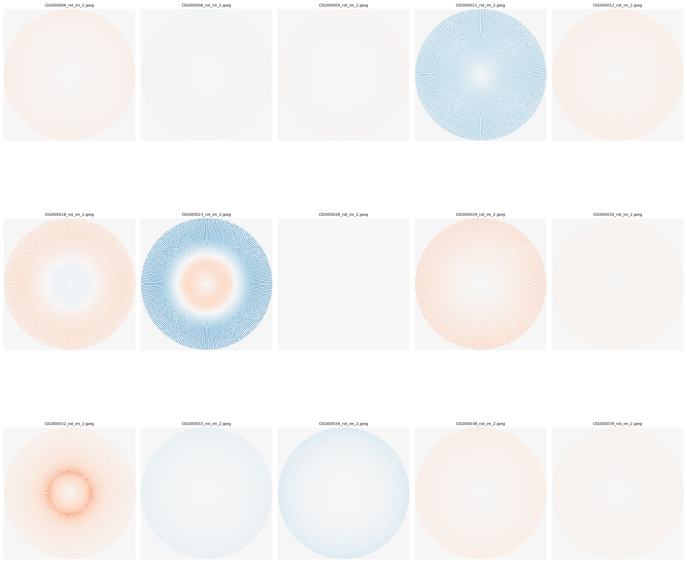
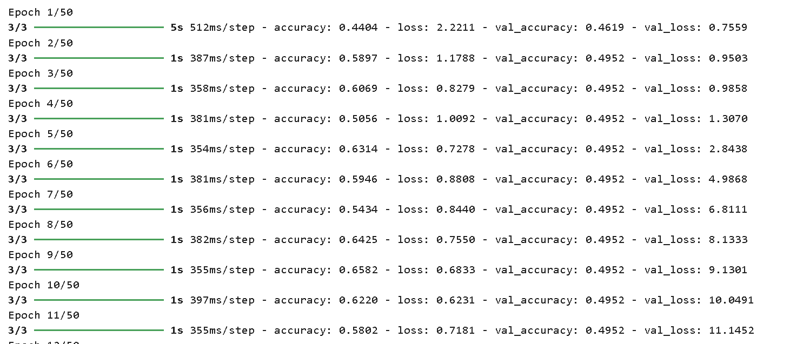

# 4. 2D Image Modelling and CNN-Classification

To enhance the classification process, we introduced an innovative approach by transforming the 1D HI profiles into 2D images. This transformation was aimed at capturing *asymmetries* within the profiles, which are often indicative of underlying galactic processes. We generated three distinct 2D image models, each designed to highlight different features of the HI profiles. CNN techniques were then applied to these images to perform a more nuanced classification, leading to improved accuracy and deeper insights into the data. The results of this 2D analysis were compared with previous classifications, offering a comprehensive evaluation of our methodology.

# Step 1: Inspection of Spectrum | CIG - AMIGA

In this part, the script processes and visualizes spectral data from a FITS file. It loads the spectrum, normalizes it, and then plots two types of visualizations. The first plot shows the normalized spectrum across all pixels. The second plot displays the spectrum split into right and left halves, with the left half inverted and negative, and also shows their combined form. The script uses `matplotlib` for plotting and `astropy` for reading FITS files. It is designed to be simple yet effective for analyzing spectral data.

```python
# 1.---------Importation of Libraries------
import matplotlib.pyplot as plt
import numpy as np
from astropy.io import fits

# 2.---------Load and Normalize Spectrum Function------
def plot_spectra(file_path):
    # Load and normalize the spectrum
    spectrum = fits.getdata(file_path)[0]
    spectrum_normalized = (spectrum - spectrum.min()) / (spectrum.max() - spectrum.min())
    
    # Create the x-axis and split the spectrum
    x = np.arange(len(spectrum_normalized))
    center = len(x) // 2
    spectrum_right = spectrum_normalized[center:]
    spectrum_left = -spectrum_normalized[center-1::-1]
    x_right = np.arange(len(spectrum_right))
    
    # Combine right and left spectra
    spectrum_combined = spectrum_right + spectrum_left
    
    # Create the plot
    plt.figure(figsize=(10, 5))
    
    # Plot normalized spectrum
    plt.subplot(2, 1, 1)
    plt.plot(x, spectrum_normalized, label='Normalized Spectrum')
    plt.xlabel('Pixel')
    plt.ylabel('Normalized Flux')
    plt.title(f'Normalized Spectrum from {file_path}')
    plt.grid(True)
    plt.legend()

    # Plot separated and combined spectra
    plt.subplot(2, 1, 2)
    plt.plot(x_right, spectrum_right, label='Right Spectrum')
    plt.plot(np.arange(len(spectrum_left)), spectrum_left, label='Left Spectrum (inverted, negative)', linestyle='--')
    plt.plot(x_right, spectrum_combined, label='Combined Spectrum', linestyle='-.')
    plt.xlabel('Pixel')
    plt.ylabel('Normalized Flux')
    plt.title('Separated and Combined Spectra')
    plt.grid(True)
    plt.legend()
    
    plt.tight_layout()
    plt.show()

# 3.---------File Path and Function Call------
# Path to the FITS file
file_path = 'D:/1. JAE Intro ICU/sp_im_busyfit/A005580.fits_busyfit_2.fits'

# Call the function to plot the spectra
plot_spectra(file_path)
```
Ouput Example:



# Step 2: 2D Image Modelling | BusyFit - CIG - AMIGA

This code processes a set of FITS files from a specified directory, focusing on files that match a particular naming convention. The code extracts spectral data from each FITS file, normalizes the spectra, and generates ring-like images based on the spectral data. It then creates combined plots that display the original spectrum, its right and left halves, and their combined form. The code saves these plots and ring images as JPEG files and also compiles them into a single PDF document. The entire process is managed by specifying an index range to select which FITS files to process, allowing for flexible analysis of large datasetTion. Three distinct 2D image models were generated for the symmetry study:

- The first is a rotation of the fitted spectrum.
- The second involves rotating the spectrum after subtracting its right and left profiles to accentuate asymmetry features.
- The third is a normalized version of the previous image, with pixel intensity adjusted to further emphasize specific image pada, 2011).

```python

   # 1.---------Importation of Libraries------
   import os
   import re
   import shutil
   import matplotlib.pyplot as plt
   import numpy as np
   from astropy.io import fits
   from matplotlib.backends.backend_pdf import PdfPages

   # 2.---------Function to Get the List of Files---------
   def get_fits_files(directory, file_pattern):
      # Compile the regex pattern provided as input
      pattern = re.compile(file_pattern)
      files = []
      
      # Iterate through files in the specified directory
      for file in os.listdir(directory):
         match = pattern.match(file)  # Check if the file matches the pattern
         if match:
               num = int(match.group(1))  # Extract the numerical part of the filename
               files.append((num, file))  # Add the file and its number to the list
      
      files.sort()  # Sort the list of files by the extracted number
      return files

   # 3.---------Functions to Process FITS Files---------
   def load_fits_spectrum(file_path):
      # Load the FITS file and extract the data
      with fits.open(file_path) as hdul:
         data = hdul[0].data
      return data

   def normalize_spectrum(spectrum):
      # Normalize the spectrum data to a range of 0 to 1
      min_val = np.min(spectrum)
      max_val = np.max(spectrum)
      normalized = (spectrum - min_val) / (max_val - min_val)
      return normalized

   def create_ring_image_from_spectrum(ax, spectrum, vmin, vmax, cmap='gray'):
      # Create a ring-like image from the spectrum data
      spectrum_length = len(spectrum)
      image_size = 2 * spectrum_length
      image = np.zeros((image_size, image_size))

      center = image_size // 2

      # Map the spectrum data to a circular pattern
      for r in range(spectrum_length):
         theta = np.linspace(0, 2 * np.pi, image_size)
         x = center + r * np.cos(theta)
         y = center + r * np.sin(theta)
         for i in range(len(x)):
               xi = int(round(x[i]))
               yi = int(round(y[i]))
               image[yi, xi] = spectrum[r]

      # Display the generated image
      ax.imshow(image, cmap=cmap, vmin=vmin, vmax=vmax, origin='lower')
      ax.axis('off')

   def plot_spectra_and_ring_images(ax_spectrum, ax_image1, ax_image2, ax_image3, file_path, file_name):
      # Load the spectrum data from the FITS file
      data = load_fits_spectrum(file_path)
      
      # Ensure the data is 1-dimensional
      if data.ndim == 2 and data.shape[0] == 1:
         spectrum = data[0]
      else:
         raise ValueError("The FITS file does not contain one-dimensional spectral data.")
      
      # Normalize the spectrum
      spectrum_normalized = normalize_spectrum(spectrum)
      x = np.arange(len(spectrum_normalized))
      
      center = len(spectrum_normalized) // 2
      spectrum_right = spectrum_normalized[center:]
      x_right = np.arange(center, len(spectrum_normalized))
      spectrum_left = -spectrum_normalized[center-1::-1]
      x_left = np.arange(center-1, -1, -1)
      
      # Ensure the left and right spectra are the same length
      min_length = min(len(spectrum_right), len(spectrum_left))
      spectrum_right = spectrum_right[:min_length]
      spectrum_left = spectrum_left[:min_length]
      x_right = x_right[:min_length]
      x_left = x_left[:min_length]

      spectrum_combined = spectrum_right + spectrum_left
      quarter_length = len(spectrum_combined) // 4
      spectrum_combined_quarter = spectrum_combined[:quarter_length]

      # Plot the different spectra
      ax_spectrum.plot(x, spectrum_normalized, label='Normalized Spectrum')
      ax_spectrum.plot(x_right, spectrum_right, label='Right Spectrum')
      ax_spectrum.plot(x_left, spectrum_left, label='Left Spectrum (inverted, negative)', linestyle='--')
      ax_spectrum.plot(x_right, spectrum_combined, label='Combined Spectrum', linestyle='-.')
      ax_spectrum.set_title(file_name, fontsize=10)
      ax_spectrum.set_xlabel('Pixel', fontsize=8)
      ax_spectrum.set_ylabel('Normalized Flux', fontsize=8)
      ax_spectrum.legend(fontsize=6)
      ax_spectrum.grid(True)

      # Create ring images from the spectra
      create_ring_image_from_spectrum(ax_image1, spectrum_normalized, vmin=0, vmax=1, cmap='RdBu')
      create_ring_image_from_spectrum(ax_image2, spectrum_combined_quarter, vmin=-1, vmax=1, cmap='RdBu')
      create_ring_image_from_spectrum(ax_image3, spectrum_combined_quarter, vmin=np.min(spectrum_combined_quarter), vmax=np.max(spectrum_combined_quarter), cmap='RdBu')

   def save_figures(num, ax_spectrum, ax_image1, ax_image2, ax_image3, fits_file_path, output_dir):
      # Create the output directory if it doesn't exist
      if not os.path.exists(output_dir):
         os.makedirs(output_dir)
      
      # Save the FITS file to the output directory
      num_str = f'{num:06}'
      shutil.copy(fits_file_path, os.path.join(output_dir, f'CIG{num_str}_busyfit_1.fits'))

      # Save the ring images as JPEG files
      fig1, ax1 = plt.subplots()
      ax1.imshow(ax_image1.images[0].get_array(), cmap='RdBu', vmin=0, vmax=1, origin='lower')
      ax1.axis('off')
      fig1.savefig(os.path.join(output_dir, f'CIG{num_str}_rot_im_1.jpeg'), bbox_inches='tight', pad_inches=0)
      plt.close(fig1)
      
      fig2, ax2 = plt.subplots()
      ax2.imshow(ax_image2.images[0].get_array(), cmap='RdBu', vmin=-1, vmax=1, origin='lower')
      ax2.axis('off')
      fig2.savefig(os.path.join(output_dir, f'CIG{num_str}_rot_im_2.jpeg'), bbox_inches='tight', pad_inches=0)
      plt.close(fig2)
      
      fig3, ax3 = plt.subplots()
      ax3.imshow(ax_image3.images[0].get_array(), cmap='RdBu', vmin=np.min(ax_image3.images[0].get_array()), vmax=np.max(ax_image3.images[0].get_array()), origin='lower')
      ax3.axis('off')
      fig3.savefig(os.path.join(output_dir, f'CIG{num_str}_rot_im_3.jpeg'), bbox_inches='tight', pad_inches=0)
      plt.close(fig3)

   def main(directory, output_dir, start_index, end_index, file_pattern):
      # Get the list of FITS files in the directory
      fits_files = get_fits_files(directory, file_pattern)

      # Filter the files within the specified index range
      fits_files = [file for file in fits_files if start_index <= file[0] <= end_index]

      num_files_to_process = len(fits_files)

      if num_files_to_process == 0:
         print("No FITS files found within the specified index range.")
         return

      num_rows = (num_files_to_process + 4) // 5
      num_cols = 5

      # Set up the subplots for spectra and ring images
      fig_spectra, axes_spectra = plt.subplots(num_rows, num_cols, figsize=(30, 20), constrained_layout=True)
      fig_image1, axes_image1 = plt.subplots(num_rows, num_cols, figsize=(20, 20), constrained_layout=True)
      fig_image2, axes_image2 = plt.subplots(num_rows, num_cols, figsize=(20, 20), constrained_layout=True)
      fig_image3, axes_image3 = plt.subplots(num_rows, num_cols, figsize=(20, 20), constrained_layout=True)

      # Process each FITS file
      for i, (num, file_name) in enumerate(fits_files):
         file_path = os.path.join(directory, file_name)
         print(f"Processing file: {file_path}")
         
         row = i // num_cols
         col = i % num_cols
         
         # Plot the spectra and ring images
         plot_spectra_and_ring_images(axes_spectra[row, col], axes_image1[row, col], axes_image2[row, col], axes_image3[row, col], file_path, file_name)
         
         # Save the figures
         save_figures(num, axes_spectra[row, col], axes_image1[row, col], axes_image2[row, col], axes_image3[row, col], file_path, output_dir)
         
         # Set titles for the ring images
         axes_image1[row, col].set_title(f'CIG{num:06}_rot_im_1.jpeg', fontsize=8)
         axes_image2[row, col].set_title(f'CIG{num:06}_rot_im_2.jpeg', fontsize=8)
         axes_image3[row, col].set_title(f'CIG{num:06}_rot_im_3.jpeg', fontsize=8)

      fig_spectra.tight_layout()
      fig_image1.tight_layout()
      fig_image2.tight_layout()
      fig_image3.tight_layout()

      # Save all figures to a single PDF file
      pdf_path = os.path.join(output_dir, 'output_figures.pdf')
      with PdfPages(pdf_path) as pdf_pages:
         pdf_pages.savefig(fig_spectra)
         pdf_pages.savefig(fig_image1)
         pdf_pages.savefig(fig_image2)
         pdf_pages.savefig(fig_image3)

      plt.show()

      print(f"PDF saved at: {pdf_path}")

   # 4.---------Input Parameters---------
   directory = 'D:/1. JAE Intro ICU/CIG/ascii-files/sp_busyfit/'
   output_dir = 'D:/1. JAE Intro ICU/CIG/ascii-files/sp_busyfit/rot_im_test'
   start_index = 0  # Change this to the desired start index
   end_index = 39  # Change this to the desired end index
   file_pattern = r'CIG(\d+)_.*_busyfit_3\.fits'  # Define the file pattern here

   # Run the main function with the specified parameters
   main(directory, output_dir, start_index, end_index, file_pattern)
```


Output example:






# Step 3: Asymmetry Classification | CIG - AMIGA

We present a Python script designed for image classification tasks using convolutional neural networks (CNNs). It processes images from a specified directory, builds a CNN model, and tunes hyperparameters (like test size, random state, and epochs) to find the best configuration. The script also includes steps for data visualization, success rate calculation, and model performance evaluation. The results, including classification success rates and visualizations, are saved in a specified results directory. The script is highly configurable, with key variables set at the beginning for easy adaptation to different datasets and scenarios.

```python

    # 1.---------Importation of Libraries------
    import os
    import numpy as np
    import matplotlib.pyplot as plt
    from matplotlib.artist import Artist, allow_rasterization
    import tensorflow as tf
    from tensorflow.keras.models import Sequential
    from tensorflow.keras.layers import Conv2D, MaxPooling2D, Flatten, Dense, Dropout, BatchNormalization
    from tensorflow.keras.preprocessing import image
    import matplotlib.pyplot as plt
    from sklearn.model_selection import train_test_split
    import pandas as pd
    from tensorflow.keras.optimizers import AdamW

    # 2.---------Configuration Variables------
    file_suffix = "_rot_im_2.jpeg"  #Selected 2D Image Model
    directory = 'D:/1. JAE Intro ICU/CIG/ascii-files/sp_busyfit/rot_im_busyfit_3' # Select Output Directory
    results_directory = os.path.join(directory, 'results_TDE5_2') # Select output file
    num_groups = 3  #Selec Number of Groups to be Classified, related to "espada2011_table1"
    espada2011_table1 = pd.read_csv(os.path.join(directory, 'Espada2011_Table1_5.csv'), delimiter=';') # Select Comparison Clasification

    # 3.---------Image Loading Function------
    def load_images(directory, file_suffix):
        images = []
        file_names = []
        for file in os.listdir(directory):
            if file.endswith(file_suffix):
                img_path = os.path.join(directory, file)
                img = image.load_img(img_path, target_size=(128, 128))
                img_array = image.img_to_array(img)
                images.append(img_array)
                file_names.append(file)
        images = np.array(images)
        return images, file_names

    # 4.---------Image Preprocessing Function------
    def preprocess_images(images):
        images = images / 255.0
        return images

    # 5.---------Model Building Function------
    def build_model(num_groups, layer_config):
        model = Sequential()
        model.add(Conv2D(layer_config[0], (3, 3), activation='relu', input_shape=(128, 128, 3)))
        model.add(BatchNormalization())
        model.add(MaxPooling2D((2, 2)))
        model.add(Dropout(0.25))
        
        for filters in layer_config[1:]:
            model.add(Conv2D(filters, (3, 3), activation='relu'))
            model.add(BatchNormalization())
            model.add(MaxPooling2D((2, 2)))
            model.add(Dropout(0.25))

        model.add(Flatten())
        model.add(Dense(512, activation='relu'))
        model.add(BatchNormalization())
        model.add(Dropout(0.5))
        model.add(Dense(num_groups, activation='softmax'))

        optimizer = AdamW(learning_rate=0.001, weight_decay=1e-5)
        model.compile(optimizer=optimizer, loss='sparse_categorical_crossentropy', metrics=['accuracy'])
        
        return model

    # 6.---------Image Classification Function------
    def classify_images(images, model):
        predictions = model.predict(images)
        predicted_classes = np.argmax(predictions, axis=1)
        return predicted_classes

    # 7.---------Visualization Function------
    def visualize_random_spectra(images, file_names, predicted_classes, num_samples=60):
        if num_samples > len(images):
            raise ValueError(f'The requested number of samples ({num_samples}) exceeds the test set size ({len(images)}).')
        
        # Ensure we don't exceed the maximum allowed subplots (10 rows * 6 columns = 60)
        num_samples = min(num_samples, 60)
        
        indices = np.random.choice(len(images), num_samples, replace=False)
        plt.figure(figsize=(20, 20))
        for i, idx in enumerate(indices):
            plt.subplot(10, 6, i + 1)
            plt.imshow(images[idx])
            plt.title(f'{file_names[idx]} - Class {predicted_classes[idx]}')
            plt.axis('off')
        plt.tight_layout()
        plt.show()

    # 8.---------Label Assignment Function------
    def assign_labels(num_samples, num_groups):
        labels = np.random.randint(0, num_groups, num_samples)
        return labels

    # 9.---------Main Function (Execution of the Experiment)------
    def main():
        os.makedirs(results_directory, exist_ok=True)  # Create the directory if it doesn't exist

        images, file_names = load_images(directory, file_suffix)
        images = preprocess_images(images)
        labels = assign_labels(len(images), num_groups)

        test_size_options = [0.7, 0.5, 0.3]
        random_state_options = [42, 99]
        epochs_options = [50, 80, 120]
        model_configs = [
            [32, 64, 128],      # Simple model
            [32, 64, 128, 256], # Medium model
            [32, 64, 128, 256, 512] # Complex model
        ]

        best_success_rate = 0
        best_model_config = None
        best_test_size = None
        best_random_state = None
        best_epochs = None

        success_rates = []  # List to store success rates for all combinations
        configurations = []  # List to store configuration details

        # 10.---------Hyperparameter Tuning Loop------
        for test_size in test_size_options:
            for random_state in random_state_options:
                for epochs in epochs_options:
                    for model_config in model_configs:
                        X_train, X_test, y_train, y_test, file_names_train, file_names_test = train_test_split(
                            images, labels, file_names, test_size=test_size, random_state=random_state
                        )
                        
                        model = build_model(num_groups, model_config)
                        model.fit(X_train, y_train, epochs=epochs, validation_data=(X_test, y_test))

                        predicted_classes = classify_images(X_test, model)

                        model_config_str = '_'.join(map(str, model_config))
                        save_path = os.path.join(results_directory, f'classification_results_{model_config_str}_testsize{test_size}_epochs{epochs}_rs{random_state}.xlsx')
                        results_df = pd.DataFrame({'File Name': file_names_test, 'Class': predicted_classes})
                        results_df.to_excel(save_path, index=False)
                        print(f'Results saved to {os.path.abspath(save_path)}')

                        classification_results = results_df

                        classification_results['cig'] = classification_results['File Name'].str.extract(r'CIG(\d+)_')[0].astype(float)
                        classification_results = classification_results.dropna(subset=['cig'])
                        classification_results['cig'] = classification_results['cig'].astype(int)

                        merged_df = pd.merge(classification_results, espada2011_table1, on='cig', how='inner')
                        merged_df['coincidence'] = (merged_df['Class_x'] == merged_df['Class_y']).astype(int)

                        # Definir transformaciones basadas en el valor de num_groups
                        if num_groups == 2:
                            transformations = {
                                'Class_y_v1': lambda x: x,
                                'Class_y_v2': lambda x: x.map({0: 1, 1: 0}),
                            }
                        elif num_groups == 3:
                            transformations = {
                                'Class_y_v1': lambda x: x,
                                'Class_y_v2': lambda x: x.map({0: 1, 1: 2, 2: 0}),
                                'Class_y_v3': lambda x: x.map({0: 2, 1: 0, 2: 1}),
                                'Class_y_v4': lambda x: x.map({0: 0, 1: 2, 2: 1}),
                                'Class_y_v5': lambda x: x.map({0: 1, 1: 0, 2: 2}),
                                'Class_y_v6': lambda x: x.map({0: 2, 1: 1, 2: 0})
                            }
                        else:
                            raise ValueError("El valor de num_groups no es válido. Debe ser 2 o 3.")

                        results = []

                        # 11.---------Transformation and Success Rate Calculation------
                        for label, transform in transformations.items():
                            merged_df[label] = transform(merged_df['Class_y'])
                            coincidence_col = (merged_df['Class_x'] == merged_df[label]).astype(int)
                            success_rate = coincidence_col.mean()
                            # Check if all classes are the same
                            unique_classes = merged_df['Class_x'].nunique()
                            results.append({
                                'Transformation': label,
                                'Success Rate': success_rate,
                                'Total Matches': coincidence_col.sum(),
                                'Total Samples': len(merged_df),
                                'Unique Classes': unique_classes
                            })

                        results_df = pd.DataFrame(results)
                        # Exclude models where all samples are classified the same
                        filtered_results_df = results_df[results_df['Unique Classes'] > 1]

                        if not filtered_results_df.empty:
                            best_transformation = filtered_results_df.loc[filtered_results_df['Success Rate'].idxmax()]
                        else:
                            continue  # Skip if all classifications are the same

                        # Store the success rate and configuration for the final plot
                        success_rates.append(best_transformation['Success Rate'])
                        configurations.append(f'Model:{model_config_str} TestSize:{test_size} Epochs:{epochs} RS:{random_state}')

                        if best_transformation['Success Rate'] > best_success_rate:
                            best_success_rate = best_transformation['Success Rate']
                            best_model_config = model_config
                            best_test_size = test_size
                            best_random_state = random_state
                            best_epochs = epochs

                        results_save_path = os.path.join(results_directory, f'transformation_results_{model_config_str}_testsize{test_size}_epochs{epochs}_rs{random_state}.xlsx')
                        with pd.ExcelWriter(results_save_path) as writer:
                            filtered_results_df.to_excel(writer, sheet_name='Transformation_Summary', index=False)
                            merged_df.to_excel(writer, sheet_name='Merged_Data', index=False)

                        print(f'Results file saved at: {os.path.abspath(results_save_path)}')

        print(f"Best configuration: Model Config: {best_model_config}, Test Size: {best_test_size}, Random State: {best_random_state}, Epochs: {best_epochs}, Success Rate: {best_success_rate}")

        # 12.---------Plot of Success Rates Across All Configurations------
        plt.figure(figsize=(12, 8))
        plt.barh(configurations, success_rates, color='skyblue')
        plt.xlabel('Success Rate')
        plt.ylabel('Configurations')
        plt.title('Success Rate Across Different Model Configurations')
        plt.tight_layout()
        plot_image_path = os.path.join(results_directory, 'success_rate_across_configurations.jpeg')
        plt.savefig(plot_image_path, format='jpeg')
        plt.show()

        # 13.---------Visualization of Samples for the Best Configuration------
        X_train, X_test, y_train, y_test, file_names_train, file_names_test = train_test_split(
            images, labels, file_names, test_size=best_test_size, random_state=best_random_state
        )
        
        model = build_model(num_groups, best_model_config)
        model.fit(X_train, y_train, epochs=best_epochs, validation_data=(X_test, y_test))
        predicted_classes = classify_images(X_test, model)
        num_samples = min(300, len(X_test))
        visualize_random_spectra(X_test, file_names_test, predicted_classes, num_samples=num_samples)

    if __name__ == "__main__":
        main()
```

Output example:




